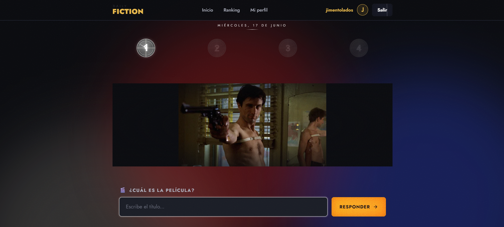
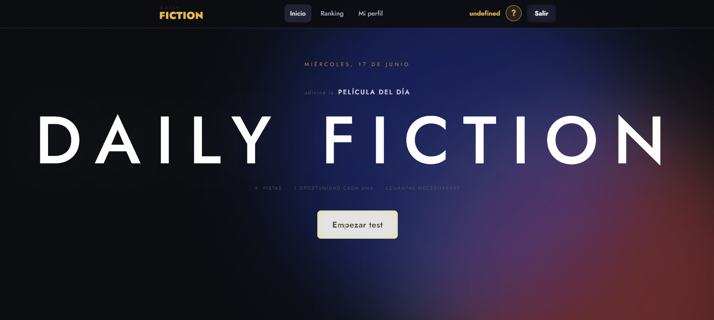
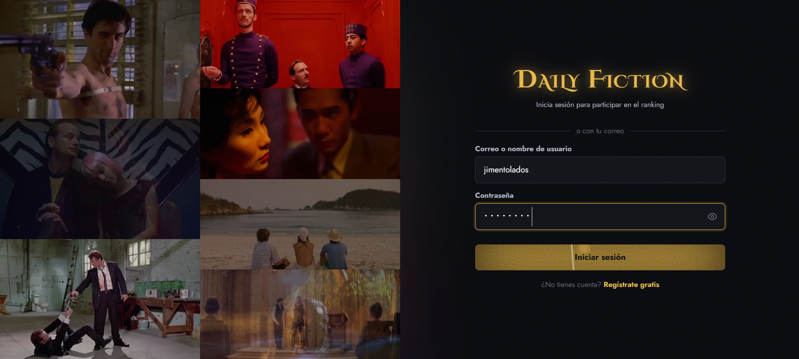
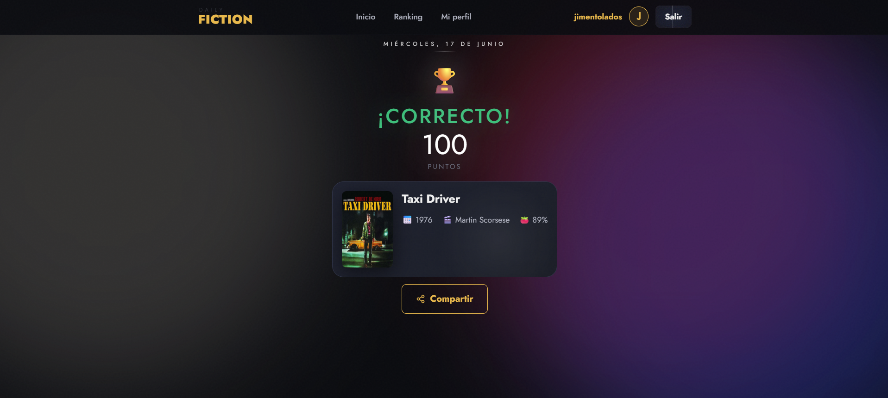
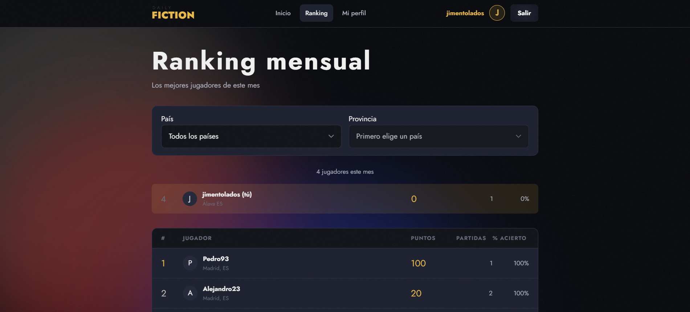
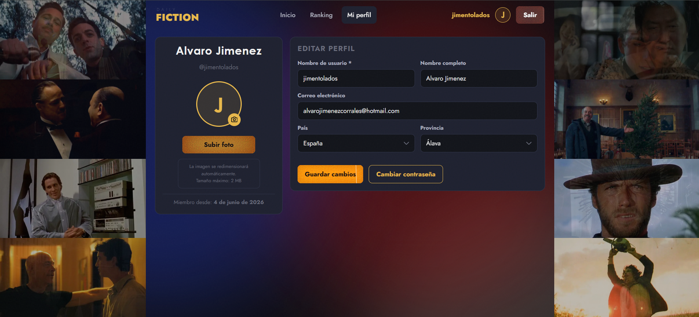

# Daily Fiction

> Adivina la película del día con hasta 4 pistas progresivas. Un reto nuevo cada 24 horas.

🌐 **[Demo en vivo](https://daily-fiction.vercel.app)** · 👤 **[LinkedIn](https://www.linkedin.com/in/alvarojimenezcorrales)**




---

## ¿Qué es?

**Daily Fiction** es un juego de trivia cinematográfica diaria inspirado en Wordle. Cada día se publica una película diferente y el jugador dispone de 4 pistas progresivas para adivinarla — de la más críptica a la más obvia. Cuanto antes aciertes, más puntos sumas al ranking mensual.

Las pistas pueden ser: fotograma, director, actor principal, año, puntuación en Rotten Tomatoes, número de Óscars, frase icónica, género, duración, país de producción o guionista.

**[→ Jugar ahora](https://daily-fiction.vercel.app)** — no hace falta cuenta, se puede jugar directamente como anónimo.

---

## Stack técnico

| Capa | Tecnología |
|------|-----------|
| Backend | Python 3.12 · Django 4.2 LTS · Django REST Framework |
| Auth | JWT (simplejwt) · Google OAuth 2.0 |
| Base de datos | PostgreSQL 16 (Docker / desarrollo) · PostgreSQL en Neon (producción) |
| Frontend | HTML5 · CSS3 · JavaScript vanilla |
| APIs externas | TMDb · OMDb · Wikidata |
| Infraestructura | Docker · docker-compose |
| CI | GitHub Actions |

---

## Características

- **Quiz diario** — una película nueva cada día, igual para todos los jugadores
- **4 pistas progresivas** — fotograma y datos de la película (director, año, Rotten Tomatoes, etc.)
- **Juego anónimo** — se puede jugar sin cuenta (sesión por `localStorage`)
- **Ranking mensual** — global, por país y por ciudad; se resetea el 1 de cada mes
- **Google OAuth** — registro e inicio de sesión con Google en un clic
- **Admin personalizado** — panel de Django con picker de fotogramas TMDb y auto-relleno de pistas


---

## Capturas

| Home | Login |
|------|-------|
|  |  |

| Quiz en juego | Resultado |
|---------------|-----------|
|  |  |

| Ranking | Perfil |
|---------|--------|
|  |  |

---

## Instalación rápida (Docker)

### Requisitos
- Docker 24+
- docker-compose v2

### Pasos

```bash
# 1. Clonar el repositorio
git clone https://github.com/jimentolados/daily-fiction.git
cd daily-fiction

# 2. Copiar variables de entorno
cp backend/.env.example backend/.env
# Edita backend/.env con tus claves de TMDb, OMDb y Google OAuth

# 3. Levantar los servicios
docker compose up
```

El backend arranca en `http://localhost:8000`.  
Las migraciones y los fixtures de logros se cargan automáticamente al arrancar.

### Abrir el frontend

Abre `frontend/index.html` en el navegador (redirecciona automáticamente al home).

> Para desarrollo con hot-reload basta con editar los ficheros bajo `frontend/` — son HTML/CSS/JS estático, sin compilación.

---

## Instalación manual (sin Docker)

<details>
<summary>Ver instrucciones</summary>

### Requisitos
- Python 3.12
- PostgreSQL 16

```bash
# Entorno virtual
python -m venv venv
source venv/Scripts/activate   # Windows
# source venv/bin/activate     # Linux / macOS

# Dependencias
pip install -r backend/requirements.txt

# Variables de entorno
cp backend/.env.example backend/.env
# Edita backend/.env

# Base de datos
cd backend
python manage.py migrate
python manage.py loaddata apps/ranking/fixtures/achievements.json

# Superusuario (opcional)
python manage.py createsuperuser

# Servidor
python manage.py runserver
```

</details>

---

## Variables de entorno

Copia `backend/.env.example` a `backend/.env` y rellena:

| Variable | Descripción |
|----------|-------------|
| `SECRET_KEY` | Clave secreta de Django |
| `DB_NAME` · `DB_USER` · `DB_PASSWORD` · `DB_HOST` · `DB_PORT` | Conexión a la BD |
| `TMDB_API_KEY` | [themoviedb.org](https://www.themoviedb.org/settings/api) |
| `OMDB_API_KEY` | [omdbapi.com](https://www.omdbapi.com/apikey.aspx) |
| `GOOGLE_CLIENT_ID` · `GOOGLE_CLIENT_SECRET` | [Google Cloud Console](https://console.cloud.google.com/) |

---

## Estructura del proyecto

```
daily-fiction/
├── .github/workflows/ci.yml  # CI con PostgreSQL real
├── backend/
│   ├── apps/
│   │   ├── users/        # CustomUser, JWT, Google OAuth, throttling
│   │   ├── movies/       # Movie, DailyTest, Clue, admin personalizado
│   │   ├── quiz/         # GameSession, GuessAttempt, scoring, constants
│   │   ├── ranking/      # MonthlyScore, Achievement, rankings con Window
│   │   └── integrations/ # Clientes TMDb, OMDb, Wikidata · management commands
│   ├── config/
│   │   └── settings/     # base · local · production
│   ├── Dockerfile
│   └── requirements.txt
├── frontend/
│   ├── pages/            # home · quiz · login · register · ranking · logros · profile
│   ├── shared/
│   │   ├── css/          # variables · reset · main · navbar · modal
│   │   └── js/           # config · utils · api · auth · main
│   └── assets/
├── docker-compose.yml
└── README.md
```

---

## API — endpoints principales

| Método | Endpoint | Descripción |
|--------|----------|-------------|
| `POST` | `/api/v1/auth/register/` | Registro con email |
| `POST` | `/api/v1/auth/login/` | Login (email o username) |
| `POST` | `/api/v1/auth/google/` | Login / registro con Google |
| `GET` | `/api/v1/quiz/today/` | Estado del test del día |
| `POST` | `/api/v1/quiz/today/guess/` | Enviar un intento |
| `GET` | `/api/v1/ranking/monthly/` | Ranking mensual paginado |
| `GET` | `/api/v1/ranking/monthly/summary/` | Top 3 + posición del usuario |
| `GET` | `/api/v1/movies/search/?q=` | Autocompletado de títulos |

---

## Decisiones técnicas

### ¿Por qué Django en lugar de FastAPI o Flask?

Django REST Framework ofrece un admin panel out-of-the-box que es clave para el workflow editorial de este proyecto: el admin revisa películas candidatas, selecciona las que quiere usar, crea los tests diarios con sus 4 pistas y escoge fotogramas TMDb desde un picker integrado. Todo eso hubiera requerido construir un CMS desde cero con cualquier otra opción.

### ¿Por qué JWT stateless en lugar de sesiones de Django?

El frontend es HTML/CSS/JS puro servido desde el sistema de archivos local (sin servidor propio). Las sesiones de Django requieren cookies con `SameSite=Lax`, lo que complica el CORS cuando el origen es `file://`. JWT se envía en el header `Authorization`, lo que funciona independientemente del origen.

### ¿Por qué Google OAuth personalizado y no social-auth-app-django?

`social_django` está pensado para el flujo de redirect OAuth (backend inicia el flujo). Este proyecto usa Google Identity Services en el frontend, que devuelve un `access_token` directamente al cliente. La view `GoogleAuthView` valida ese token contra la userinfo API de Google y emite tokens JWT propios — es el flujo correcto para una SPA stateless.

### ¿Por qué juego anónimo con `X-Session-Key` en lugar de cookies?

Permite jugar sin cuenta sin necesidad de sesiones del servidor. El `session_key` es un UUID generado en el frontend y almacenado en `localStorage`. Se envía en un header custom, lo que es explícito y no interfiere con el flujo de autenticación JWT.

### ¿Por qué PostgreSQL en todos los entornos?

El backend corre sobre PostgreSQL 16 en desarrollo (Docker) y PostgreSQL en producción (Neon serverless + Render). Usar el mismo motor en ambos entornos elimina la clase de bugs que aparecen por diferencias entre bases de datos — especialmente relevante para la query de ranking con `Window(Rank())`.

### ¿Por qué ranking con `Window(expression=Rank())`?

Calcular la posición de cada usuario en el ranking con Python requirería cargar todos los registros en memoria. La función `Rank()` de PostgreSQL/MariaDB calcula la posición en una sola query, paginable y eficiente para miles de usuarios.

---

## Tests

```bash
cd backend
python manage.py test apps.users apps.quiz --verbosity=2
```

Cobertura de los casos críticos de negocio:
- Registro, login, cambio de contraseña y email
- Creación de sesiones de quiz (autenticada y anónima)
- Lógica de acierto/fallo y revelación de pistas
- Puntuación por pista (100 / 70 / 40 / 10 / 0)
- Normalización de títulos (acentos, mayúsculas, puntuación)

---

## Roadmap

- [x] Despliegue en producción (Render + Vercel)
- [ ] Modo mobile-first con PWA (offline support)
- [ ] Estadísticas históricas del usuario (distribución de pistas)
- [ ] API pública documentada con Swagger/OpenAPI
- [ ] Rate limiting configurable por entorno

---

## Licencia

MIT
